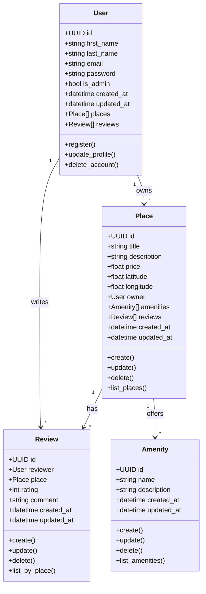

```mermaid
classDiagram
    class User {
        +UUID id
        +string first_name
        +string last_name
        +string email
        +string password
        +bool is_admin
        +datetime created_at
        +datetime updated_at
        +Place[] places
        +Review[] reviews
        +register()
        +update_profile()
        +delete_account()
    }

    class Place {
        +UUID id
        +string title
        +string description
        +float price
        +float latitude
        +float longitude
        +User owner
        +Amenity[] amenities
        +Review[] reviews
        +datetime created_at
        +datetime updated_at
        +create()
        +update()
        +delete()
        +list_places()
    }

    class Review {
        +UUID id
        +User reviewer
        +Place place
        +int rating
        +string comment
        +datetime created_at
        +datetime updated_at
        +create()
        +update()
        +delete()
        +list_by_place()
    }

    class Amenity {
        +UUID id
        +string name
        +string description
        +datetime created_at
        +datetime updated_at
        +create()
        +update()
        +delete()
        +list_amenities()
    }

    User "1" --> "*" Place : owns
    User "1" --> "*" Review : writes
    Place "1" --> "*" Review : has
    Place "1" --> "*" Amenity : offers
```
