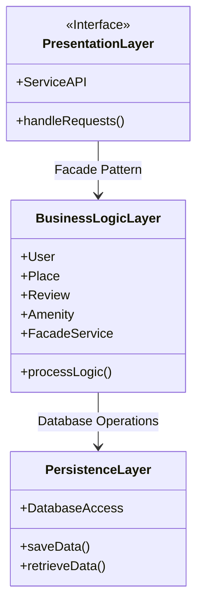
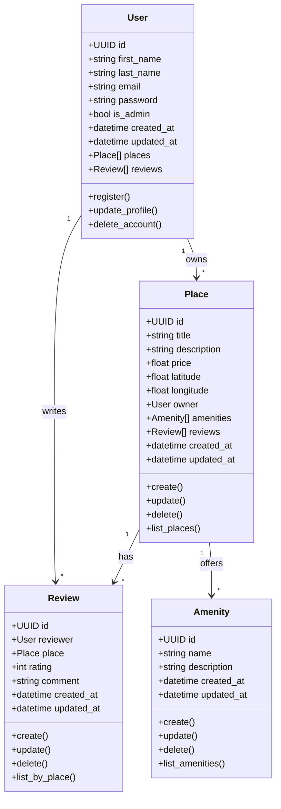
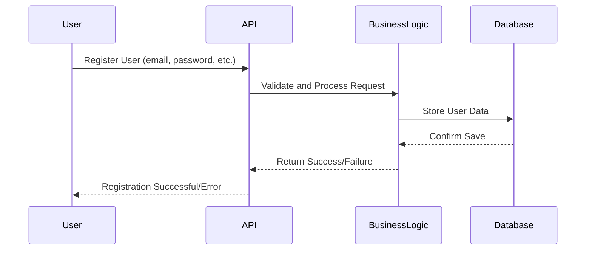
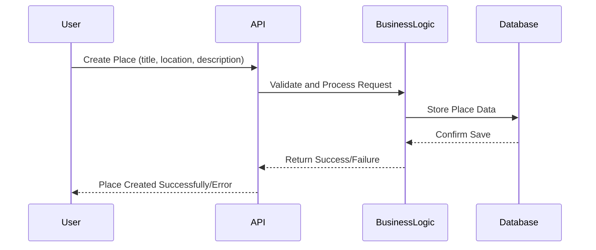
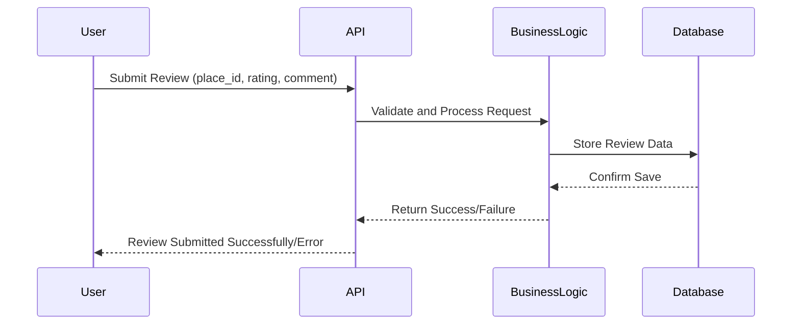

# HBnB Project - Technical Documentation

## 📌 Introduction

### 🎯 Purpose and Scope
This document serves as a detailed technical guide for the **HBnB** project. It provides essential diagrams and explanations defining the system's architecture and design, ensuring a consistent and efficient development process. It is intended for **developers, stakeholders, and future maintainers** of the application.

### 🌍 Project Overview
**HBnB** is a web-based property rental and management application. It follows a **modular architecture**, adhering to best software development practices and leveraging **object-oriented programming principles** and **design patterns** to ensure **scalability and maintainability**.

### 📖 Document Structure
This document is structured as follows:

- **🔹 High-Level Architecture**: Overview and package diagram.
- **🔹 Business Logic Layer**: Class diagram and entity relationships.
- **🔹 API Interaction Flow**: Sequence diagrams and data flow explanations.
- **🔹 Explanatory Notes**: Design decisions and rationale.

---

## 🔹 High-Level Architecture

### 🏗 Overview
HBnB follows a **layered architecture** to ensure **separation of concerns, maintainability, and scalability**. The key layers include:

- **📌 Presentation Layer**: Manages user interactions through a web interface or API endpoints.
- **📌 Business Logic Layer**: Implements application rules and processes user requests.
- **📌 Data Access Layer**: Manages database interactions and persistence.
- **📌 Infrastructure Layer**: Provides support for caching, authentication, and security.

### 📊 High-Level Package Diagram

### 📌 Explanation

- **Presentation Layer**: RESTful API for interacting with the application.
- **Business Logic Layer**: Core classes handling business logic.
- **Data Access Layer**: Ensures efficient and secure data storage and retrieval.
- **Infrastructure Layer**: Auxiliary services such as authentication and security.

---

## 🔹 Business Logic Layer

### 📊 Class Diagram

### 🔑 Key Entities and Their Relationships
- **User**: Represents individuals interacting with the application.
- **Place**: Defines rental properties and their attributes.
- **Review**: Captures user-generated feedback.
- **Amenity**: Lists available amenities for a property.

### 📌 Design Considerations
- **Use of inheritance** for common attributes.
- **Encapsulation** ensures secure data access.
- **Associations** represent real-world relationships.

---

## 🔹 API Interaction Flow

### 📝 Sequence Diagrams

#### 1️⃣ User Registration

#### 2️⃣ Place Creation

#### 3️⃣ Review Submission

---

## 🔹 Explanatory Notes

### 🔑 Key Design Decisions
- **Layered Architecture**: Ensures modularity and maintainability.
- **Object-Oriented Principles**: Enhance reusability and scalability.
- **RESTful API**: Facilitates interoperability.
- **Security Measures**: Token-based authentication and data encryption.

### 🔄 How Components Fit Together
- **Presentation Layer**: User interface.
- **Business Logic Layer**: Processes requests.
- **Data Access Layer**: Manages database operations.
- **Infrastructure Layer**: Security and performance.

---

## 📌 Conclusion

This document consolidates the **key design and implementation guidelines** for the **HBnB** project. It provides a **structured and detailed reference** for developers to ensure a **consistent and efficient development process**.

---

## ✍️ Authors

- **Martin Gwendal** (@Hericksen)
- **Moinet Hamza** (@HamzaMoinet)
- **Bouvier Guillaume** (@BvrGuillaume)
