HBnB Project Technical Documentation

1. Introduction

Purpose and Scope

This document serves as a comprehensive technical guide for the HBnB project. It compiles essential diagrams and explanatory notes that define the system’s architecture and design, facilitating implementation and ensuring consistency across development phases. The document provides a detailed reference for developers, stakeholders, and future maintainers of the application.

Project Overview

HBnB is a web-based application designed for property rental and management. It features a modular architecture following best practices in software development, leveraging object-oriented principles and design patterns to ensure scalability and maintainability.

Document Structure

This document is structured as follows:

High-Level Architecture: Overview and package diagram.

Business Logic Layer: Class diagram and entity relationships.

API Interaction Flow: Sequence diagrams and data flow explanations.

Explanatory Notes: Design decisions and rationale.

2. High-Level Architecture

Overview

HBnB follows a layered architecture that ensures separation of concerns, maintainability, and scalability. The key layers include:

Presentation Layer: Handles user interactions through a web interface or API endpoints.

Business Logic Layer: Implements application rules and processes user requests.

Data Access Layer: Manages database interactions and persistence.

Infrastructure Layer: Provides underlying support for system operations, such as caching, authentication, and security.

High-Level Package Diagram

Explanation

The Presentation Layer consists of RESTful API endpoints.

The Business Logic Layer contains core classes responsible for processing application logic.

The Data Access Layer interacts with the database, ensuring efficient and secure data storage and retrieval.

The Infrastructure Layer provides auxiliary services, including authentication and security protocols.

3. Business Logic Layer

Class Diagram

Key Entities and Their Relationships

User: Represents individuals interacting with the application.

Place: Defines rental properties and their attributes.

Review: Captures user-generated feedback.

Reservation: Manages booking information and availability.

Payment: Handles financial transactions related to rentals.

Design Considerations

Use of inheritance for common attributes.

Encapsulation ensures secure data access.

Associations (one-to-many, many-to-many) to represent real-world relationships.

4. API Interaction Flow

Sequence Diagrams

# Sequence Diagrams for API Calls

## Objective
The following sequence diagrams illustrate the interaction between the different layers (Presentation, Business Logic, and Persistence) in the HBnB application for handling various API calls.

## API Calls
### 1. User Registration

**Explanation:**
- The user sends a registration request to the API.
- The API forwards the request to the business logic for validation and processing.
- The business logic interacts with the database to save user details.
- Once saved, a response is returned to the API, which sends a final response to the user.

### 2. Place Creation

**Explanation:**
- The user submits a request to create a place.
- The API routes the request to business logic for validation.
- The data is stored in the database, and a confirmation is returned.
- The API then responds to the user with the outcome.

### 3. Review Submission

**Explanation:**
- The user submits a review for a specific place.
- The API processes the request via the business logic layer.
- The review is stored in the database, and the process concludes with a response to the user.

### 4. Fetching a List of Places

```mermaid
sequenceDiagram
    participant User
    participant API
    participant BusinessLogic
    participant Database

    User->>API: Request Places (filters: location, price, etc.)
    API->>BusinessLogic: Process Request & Apply Filters
    BusinessLogic->>Database: Fetch Matching Places
    Database-->>BusinessLogic: Return Places List
    BusinessLogic-->>API: Return Places Data
    API-->>User: Display List of Places
```

**Explanation:**
- The user requests a list of places based on filters.
- The API forwards the request to business logic, which queries the database.
- The filtered results are returned through the API to the user.

User Registration and Authentication

The user submits registration details.

The system validates input and stores user data.

The user logs in with credentials.

A token-based authentication system verifies access.

Property Listing and Booking

A user requests available properties.

The system retrieves and returns filtered results.

The user selects a property and initiates a booking.

The system verifies availability and confirms the booking.

5. Explanatory Notes

Key Design Decisions

Layered Architecture: Ensures modularity and ease of maintenance.

Object-Oriented Principles: Enhance reusability and scalability.

RESTful API: Facilitates interoperability and ease of integration.

Security Measures: Token-based authentication and data encryption for secure transactions.

How Components Fit Together

The Presentation Layer provides an interface for user interactions.

The Business Logic Layer processes requests and applies application rules.

The Data Access Layer securely manages persistence.

The Infrastructure Layer ensures reliable application performance.

6. Conclusion

This document consolidates the fundamental design and implementation guidelines for the HBnB project. It provides a structured and detailed reference for developers to ensure a consistent and efficient development process.

Authors:

- Martin Gwendal [@Hericksen](https://github.com/Hericksen)
- Moinet Hamza [@HamzaMoinet](https://www.github.com/HamzaMoinet)
- Bouvier Guillaume [@BvrGuillaume](https://www.github.com/BvrGuillaume)
